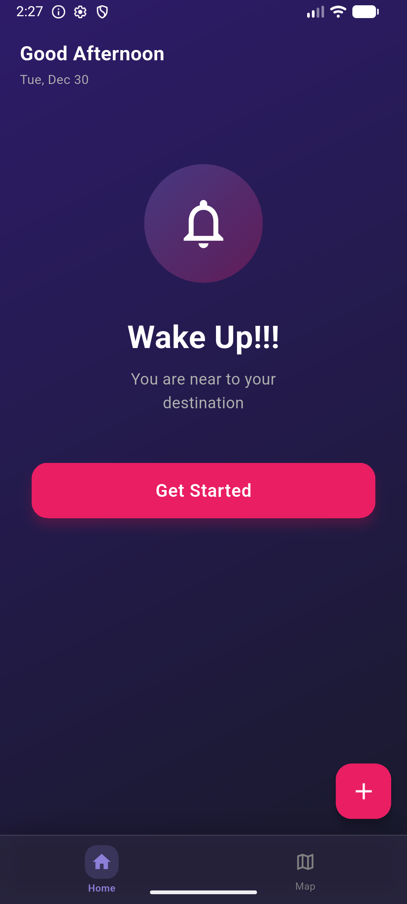
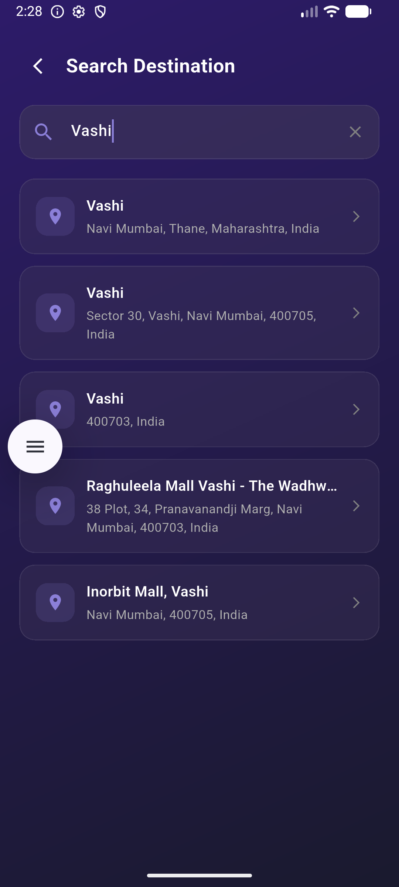
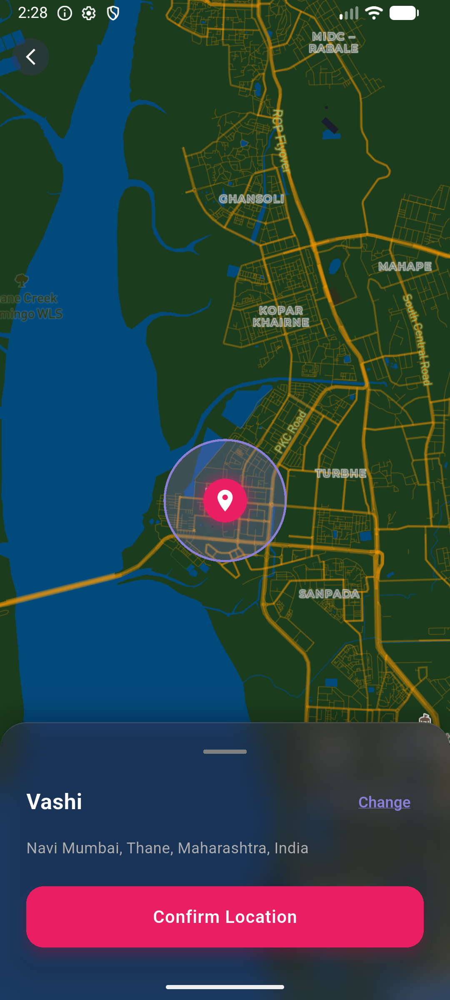

# 🌅 Wake Arrival

A sophisticated location-based alarm application built with Flutter that intelligently wakes users when they arrive at their destination. Perfect for commuters, travelers, and anyone who needs reliable geolocation-triggered alerts.

## ✨ Key Features

- **🗺️ Smart Geofencing**: Real-time location tracking using Google Maps with geofence boundaries
- **📍 Destination Search**: Integrated Mapbox search for easy location selection
- **🔔 Local Notifications**: Push notifications when you arrive at your destination
- **🔊 Audio Alerts**: Custom audio playback with text-to-speech support
- **💾 Persistent Storage**: Local database with ObjectBox for offline access
- **🎨 Dark Theme UI**: Beautiful Material Design with carefully crafted UI/UX
- **⏱️ Background Service**: Continuous geofence monitoring even when app is minimized
- **📅 Local Time Formatting**: Intelligent date/time formatting with internationalization support

## 📱 Screenshots

<div align="center">

| Home Screen                          | Destination Search                            |
| ------------------------------------ | --------------------------------------------- |
|  |  |

| Map Selection                    | Active Alarm                                  |
| -------------------------------- | --------------------------------------------- |
|  |  |

</div>

### Features Showcased:

- **Home Screen**: Wake up notification when you've arrived at your destination
- **Destination Search**: Integrated Mapbox location search with autocomplete suggestions
- **Map View**: Interactive map with visual geofence radius to set arrival radius
- **Active Alarm**: Displays active location-based alarms with edit/delete options

### Architecture & Patterns

- **State Management**: BLoC pattern with `flutter_bloc` for scalable state handling
- **Database**: ObjectBox for high-performance local storage with type-safe queries
- **Services Layer**: Modular service architecture for separation of concerns
- **Responsive Design**: Adaptive layouts supporting various screen sizes

### Core Libraries & Integrations

| Technology                    | Purpose                                       |
| ----------------------------- | --------------------------------------------- |
| `flutter_map`                 | Interactive mapping and visualization         |
| `mapbox_search`               | Location search with autocomplete             |
| `geofence_foreground_service` | Background geofencing and location monitoring |
| `location` & `geocoding`      | Device GPS and reverse geocoding              |
| `flutter_tts`                 | Text-to-speech for audio notifications        |
| `flutter_local_notifications` | System notification delivery                  |
| `intl`                        | Internationalization and date formatting      |

## 🚀 Getting Started

### Prerequisites

- Flutter SDK (>=3.0.0)
- Android SDK / Xcode
- Mapbox API key (for location search)
- Android/iOS permissions configured

### Installation

1. **Clone the repository**

   ```bash
   git clone https://github.com/yourusername/wake_arrival.git
   cd wake_arrival
   ```

2. **Install dependencies**

   ```bash
   flutter pub get
   ```

3. **Generate ObjectBox models**

   ```bash
   dart run build_runner build
   ```

4. **Configure API keys**

   - Add Mapbox API key to your Android/iOS configuration
   - Update permissions in `AndroidManifest.xml` and `Info.plist`

5. **Run the app**
   ```bash
   flutter run
   ```

## 📦 Project Structure

```
lib/
├── main.dart                 # App entry point with geofence callback dispatcher
├── app.dart                  # Material app configuration
├── common/
│   ├── pages/               # UI screens (splash, home, map, settings)
│   ├── services/            # Business logic
│   │   ├── alarm_storage_service.dart
│   │   ├── audio_service.dart
│   │   └── notification_service.dart
│   ├── widgets/             # Reusable UI components
│   ├── theme/               # Design system and styling
│   └── extension/           # Dart extensions
├── models/                  # Data models and routing
└── objectbox-model.json     # Database schema
```

## 🎯 Key Implementation Details

### Geofencing & Background Processing

- Implements `@pragma('vm:entry-point')` for background callback handling
- Monitors enter/exit/dwell events for location-based triggers
- Seamlessly handles foreground service permissions (Android 12+)

### Local Data Persistence

- ObjectBox for type-safe, fast local storage
- Automatic code generation with `objectbox_generator`
- Stores alarm history and user preferences

### User Experience

- Dark theme by default for eye comfort during night usage
- Smooth animations and transitions
- Responsive UI that adapts to different screen sizes
- Integrated voice feedback via TTS

## 🧪 Testing

Currently includes widget tests. To run tests:

```bash
flutter test
```

## 📝 Code Quality

- Follows Dart/Flutter style guidelines
- Uses `flutter_lints` for consistent code quality
- Modular architecture for easy testing and maintenance
- Type-safe implementation with null safety

## 🤝 Contributing

Contributions are welcome! Please feel free to submit a Pull Request.

## 📄 License

This project is licensed under the MIT License - see the LICENSE file for details.

## 👨‍💻 About the Developer

Built with attention to detail, best practices in Flutter development, and a focus on user experience. This project demonstrates expertise in:

- Native and cross-platform mobile development
- Real-time location services and geofencing
- State management and architecture patterns
- Integration of third-party APIs and services
- Background processing and system permissions

## 📞 Contact & Links

- GitHub: [your-github-profile](https://github.com/yourusername)
- LinkedIn: [your-linkedin](https://linkedin.com/in/yourprofile)
- Email: your.email@example.com
